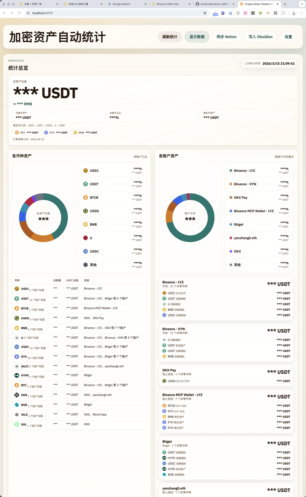
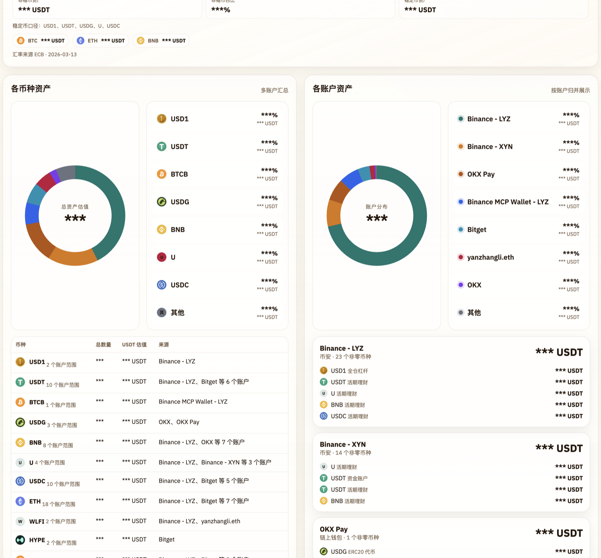

# 加密资产自动统计与报告

[English](./README.md)

这是一个本地优先的加密资产净值统计工具，适合资产分散在 `Binance`、`Bitget`、`OKX`、多链 EVM 钱包，以及部分 DeFi 协议中的用户。它提供一个可直接使用的网页面板，也支持把结果继续写入 `Notion` 和 `Obsidian`。

## 效果预览





## 这个项目适合谁

- 想把多个交易所和链上钱包资产统一汇总的人
- 不想继续手工维护净值表格的人
- 希望每周把净值记录同步到 `Notion` 或 `Obsidian` 的人
- 希望把数据留在本地，而不是交给在线托管服务的人

## 你可以得到什么

- 一个日常可用的浏览器统计面板
- 一个适合自动化和脚本调用的 CLI
- 一键同步到 `Notion`
- 一键写入 `Obsidian`
- 一套可作为本地 Skill 后端复用的执行核心

## 当前支持范围

### 交易所

- `Binance`
  - `spot`
  - `funding`
  - `simple_earn_flexible`
  - `simple_earn_locked`
  - `cross_margin`
  - `isolated_margin`
  - `um_futures`
  - `cm_futures`
  - 现货 / 杠杆 / 合约子账户
- `Bitget`
  - `spot`
  - `funding`
  - `futures`
  - `cross_margin`
  - `savings_flexible`
  - `savings_fixed`
  - `overview`
- `OKX`
  - `trading`
  - `funding`
  - `savings`
  - `overview`

### 钱包与链上

- 支持以下 EVM 链：
  - `Ethereum`
  - `Arbitrum`
  - `Base`
  - `Optimism`
  - `BSC`
  - `Polygon`
  - `World Chain`
  - `X Layer`
- 原生资产余额
- 通过 `Alchemy` 自动发现 ERC20
- 自动发现不足时，可手动补充 ERC20

### 已支持的部分 DeFi

- 基于地址识别的 `Zerion`
- `Venus`
- `Morpho`
- `WLFI Unlock`

## 第一次使用前需要准备什么

根据你的实际需求，通常需要准备以下信息中的一部分或全部：

- `Binance` API Key / Secret
- `Bitget` API Key / Secret / Passphrase
- `OKX` API Key / Secret / Passphrase
- `Alchemy` API Key，用于更完整的 ERC20 自动发现
- `Zerion` API Key，用于更广的 DeFi 覆盖
- `Notion` Integration Token 和目标 Database ID
- `Obsidian` 本地 Vault 路径

## 快速开始

### 1. 安装依赖

```bash
npm install
```

### 2. 启动网页

```bash
npm start
```

然后打开 [http://localhost:4173](http://localhost:4173)。

### 3. 填好设置并刷新统计

在网页设置里：

- 添加交易所账户
- 添加钱包地址
- 按需填写 Notion / Obsidian 相关配置
- 点击刷新获取最新资产快照

## CLI 用法

如果你想不依赖网页，直接复用统计核心：

```bash
cp config.example.json config.local.json
npm run report -- --config ./config.local.json
```

常见变体：

```bash
npm run report -- --config ./config.local.json --output json
npm run report -- --config ./config.local.json --sync-notion
npm run report -- --config ./config.local.json --write-obsidian
```

命令行初始化和查看配置：

```bash
npm run config -- init
npm run config -- show
```

示例：

```bash
npm run config -- set-meta --key notionToken --value <token>
npm run config -- add-wallet --label "主钱包" --address 0x123...
npm run config -- add-cex --exchange binance --label "Binance 主账户" --api-key <key> --api-secret <secret>
```

## Notion 与 Obsidian

### Notion

你可以在网页设置或本地配置中填写：

- `Notion Token`
- 净值汇总库 ID
- 账户明细库 ID
- 币种明细库 ID

当前支持写入：

- 净值汇总
- 账户维度明细
- 币种维度明细

### Obsidian

你可以在网页设置或本地配置中填写：

- 本地 Vault 路径
- 输出目录

当前支持写入：

- 每周 Markdown 周报
- 统计摘要截图
- 指定目录下的索引页

## 可作为 Skill 的执行后端

仓库中已经包含了面向 Skill 的执行层：

- `scripts/manage-config.js`
- `scripts/run-report.js`
- `skills/crypto-asset-report/`

这意味着你可以在不重写采集逻辑的前提下，把这套项目作为本地 Skill 的执行核心来复用。

## 安全提醒

- 不要提交真实 API Key、Secret、Token、导出的配置文件或本地 Vault 路径
- `config.local.json` 只应保存在本地
- 如果你曾经用真实凭证进行过本地测试，公开项目前建议先轮换这些凭证

